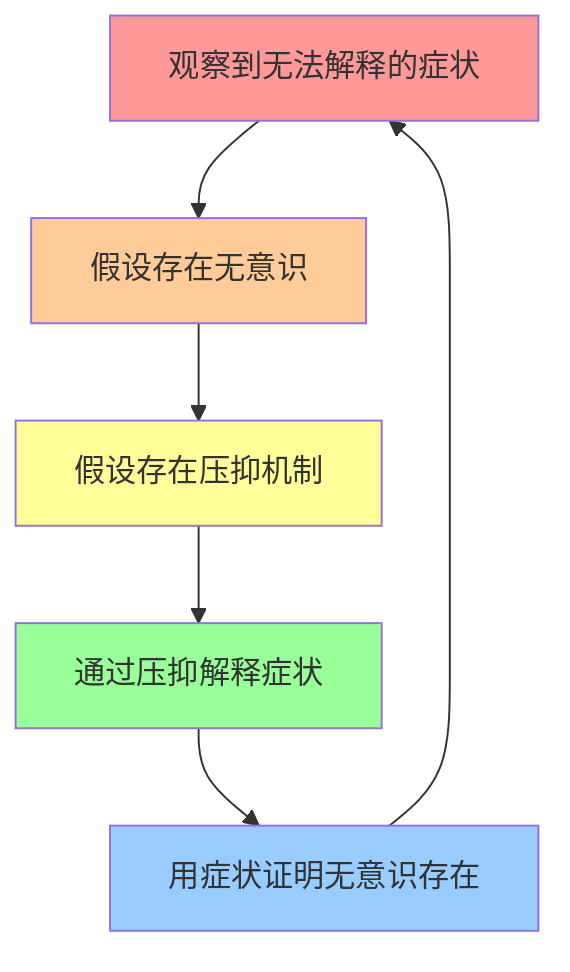
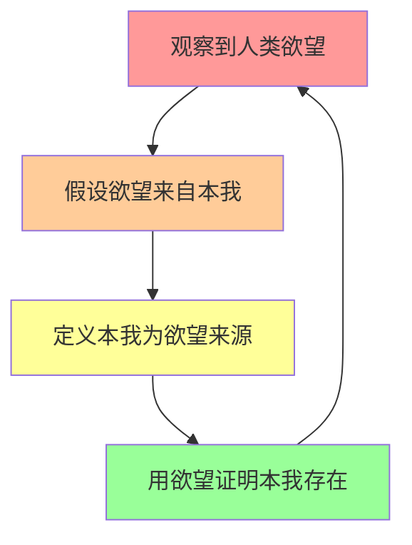
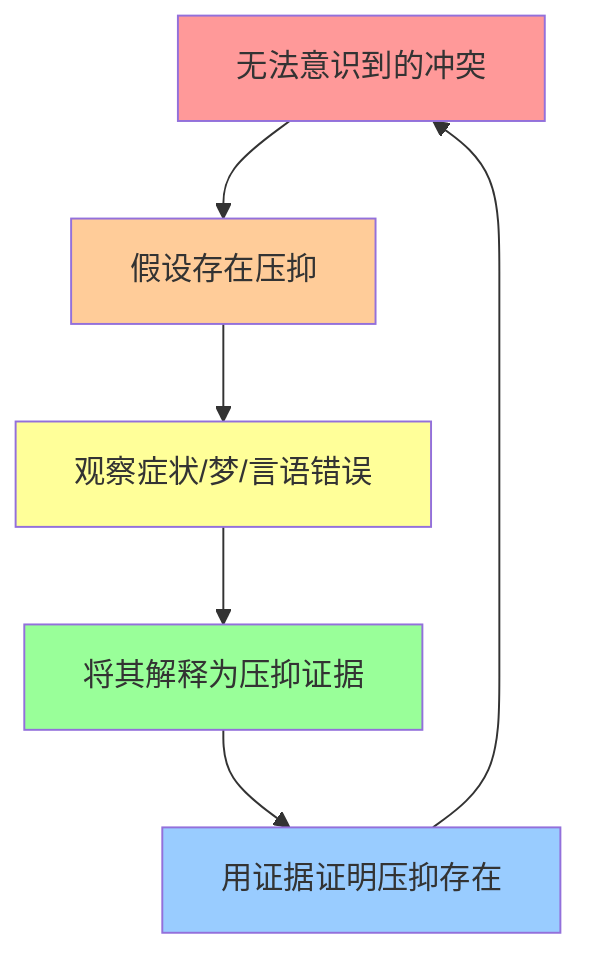
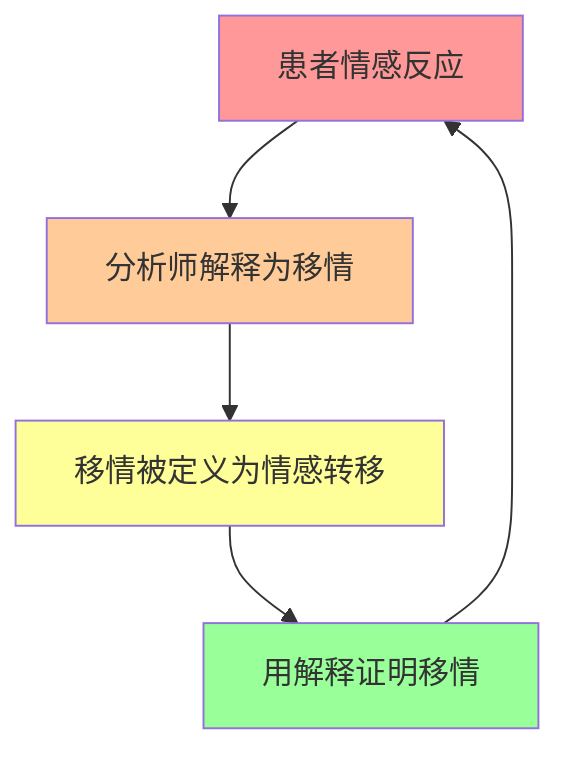
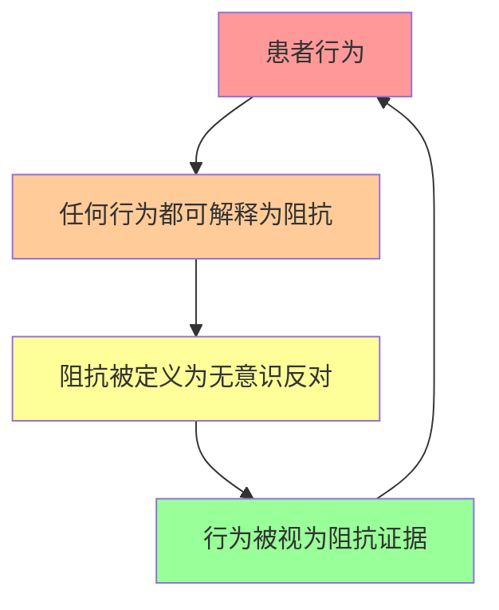
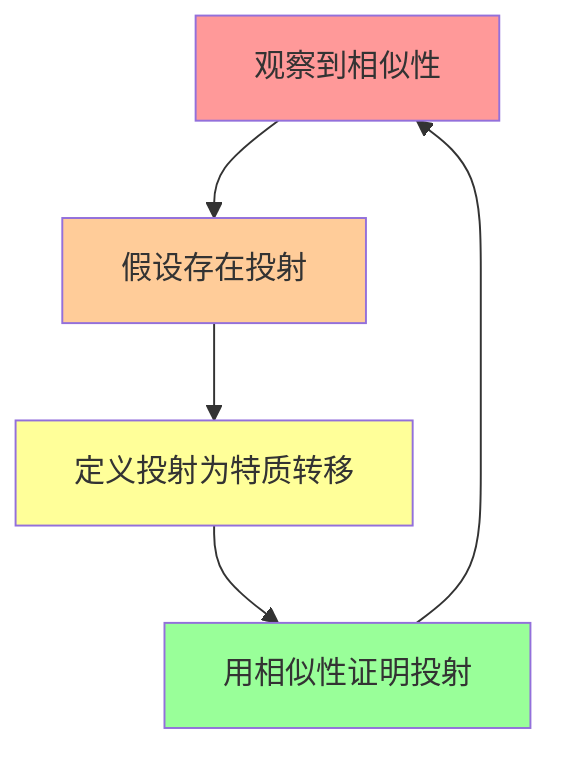
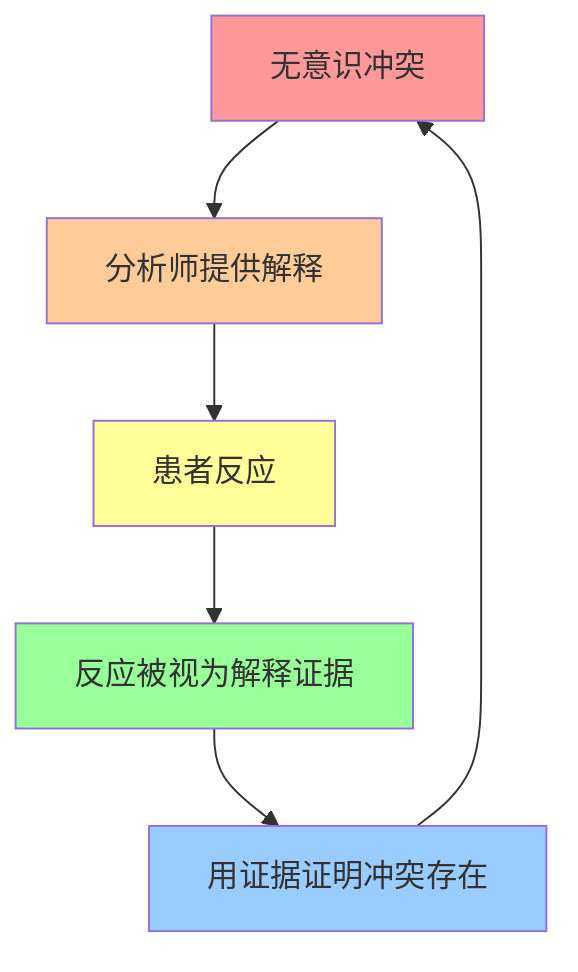
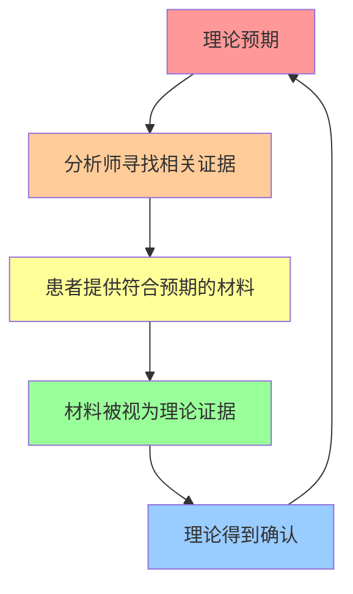
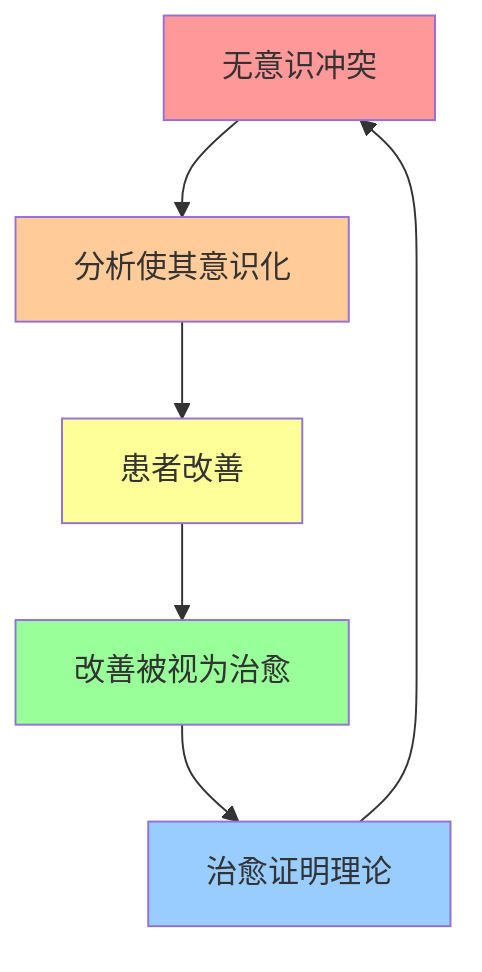
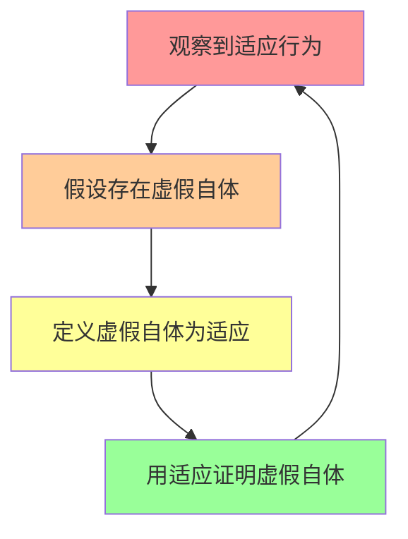

# 循环论证可视化图表

## 1. 无意识的循环论证

```mermaid
graph TD
    A["观察到无法解释的症状"] --> B["假设存在无意识"]
    B --> C["假设存在压抑机制"]
    C --> D["通过压抑解释症状"]
    D --> E["用症状证明无意识存在"]
    E --> A
    
    style A fill:#ff9999
    style B fill:#ffcc99
    style C fill:#ffff99
    style D fill:#99ff99
    style E fill:#99ccff
```

## 2. 本我的循环论证

```mermaid
graph TD
    A["观察到人类欲望"] --> B["假设欲望来自本我"]
    B --> C["定义本我为欲望来源"]
    C --> D["用欲望证明本我存在"]
    D --> A
    
    style A fill:#ff9999
    style B fill:#ffcc99
    style C fill:#ffff99
    style D fill:#99ff99
```

## 3. 压抑的循环论证

```mermaid
graph TD
    A["无法意识到的冲突"] --> B["假设存在压抑"]
    B --> C["观察症状/梦/言语错误"]
    C --> D["将其解释为压抑证据"]
    D --> E["用证据证明压抑存在"]
    E --> A
    
    style A fill:#ff9999
    style B fill:#ffcc99
    style C fill:#ffff99
    style D fill:#99ff99
    style E fill:#99ccff
```

## 4. 移情的循环论证

```mermaid
graph TD
    A["患者情感反应"] --> B["分析师解释为移情"]
    B --> C["移情被定义为情感转移"]
    C --> D["用解释证明移情"]
    D --> A
    
    style A fill:#ff9999
    style B fill:#ffcc99
    style C fill:#ffff99
    style D fill:#99ff99
```

## 5. 阻抗的循环论证

```mermaid
graph TD
    A["患者行为"] --> B["任何行为都可解释为阻抗"]
    B --> C["阻抗被定义为无意识反对"]
    C --> D["行为被视为阻抗证据"]
    D --> A
    
    style A fill:#ff9999
    style B fill:#ffcc99
    style C fill:#ffff99
    style D fill:#99ff99
```

## 6. 投射的循环论证

```mermaid
graph TD
    A["观察到相似性"] --> B["假设存在投射"]
    B --> C["定义投射为特质转移"]
    C --> D["用相似性证明投射"]
    D --> A
    
    style A fill:#ff9999
    style B fill:#ffcc99
    style C fill:#ffff99
    style D fill:#99ff99
```

## 7. 解释的循环论证

```mermaid
graph TD
    A["无意识冲突"] --> B["分析师提供解释"]
    B --> C["患者反应"]
    C --> D["反应被视为解释证据"]
    D --> E["用证据证明冲突存在"]
    E --> A
    
    style A fill:#ff9999
    style B fill:#ffcc99
    style C fill:#ffff99
    style D fill:#99ff99
    style E fill:#99ccff
```

## 8. 俄狄浦斯情结的循环论证

```mermaid
graph TD
    A["理论预期"] --> B["分析师寻找相关证据"]
    B --> C["患者提供符合预期的材料"]
    C --> D["材料被视为理论证据"]
    D --> E["理论得到确认"]
    E --> A
    
    style A fill:#ff9999
    style B fill:#ffcc99
    style C fill:#ffff99
    style D fill:#99ff99
    style E fill:#99ccff
```

## 9. 精神分析治疗的循环论证

```mermaid
graph TD
    A["无意识冲突"] --> B["分析使其意识化"]
    B --> C["患者改善"]
    C --> D["改善被视为治愈"]
    D --> E["治愈证明理论"]
    E --> A
    
    style A fill:#ff9999
    style B fill:#ffcc99
    style C fill:#ffff99
    style D fill:#99ff99
    style E fill:#99ccff
```

## 10. 虚假自体的循环论证

```mermaid
graph TD
    A["观察到适应行为"] --> B["假设存在虚假自体"]
    B --> C["定义虚假自体为适应"]
    C --> D["用适应证明虚假自体"]
    D --> A
    
    style A fill:#ff9999
    style B fill:#ffcc99
    style C fill:#ffff99
    style D fill:#99ff99
```
